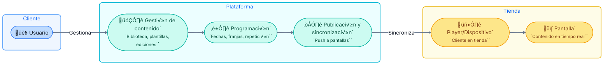

```mermaid
%%{init: {

  "theme": "base",

  "themeVariables": {

    "primaryColor": "#0ea5e9",

    "primaryTextColor": "#0b1220",

    "primaryBorderColor": "#0284c7",

    "lineColor": "#6b7280",

    "secondaryColor": "#22c55e",

    "tertiaryColor": "#f59e0b",

    "fontFamily": "Inter, Segoe UI, Roboto, Arial",

    "edgeLabelBackground":"#ffffff"

  }

}}%%

flowchart LR

    %% --- Nodos ---

    U1([👤 Usuario])

    CM([🗂️ Gestión de contenido`<br/><small>`Biblioteca, plantillas, ediciones`</small>`])

    SCH([⏱️ Programación`<br/><small>`Fechas, franjas, repetición`</small>`])

    DEP([☁️ Publicación y sincronización`<br/><small>`Push a pantallas`</small>`])

    PL([🖥️ Player/Dispositivo`<br/><small>`Cliente en tienda`</small>`])

    DS([üì∫ Pantalla`<br/><small>`Contenido en tiempo real`</small>`])

    %% --- Subgrupos ---

    subgraph Cliente

    direction LR

    U1

    end

    subgraph Plataforma

    direction LR

    CM --> SCH --> DEP

    end

    subgraph Tienda

    direction LR

    PL --> DS

    end

    %% --- Flujo principal ---

    U1 == Gestiona ==> CM

    DEP == Sincroniza ==> PL

    %% --- Estilos por grupo ---

    classDef cliente fill:#dbeafe,stroke:#60a5fa,color:#0b1220,stroke-width:1.5px;

    classDef plataforma fill:#ecfeff,stroke:#06b6d4,color:#0b1220,stroke-width:1.5px;

    classDef tienda fill:#fef9c3,stroke:#eab308,color:#0b1220,stroke-width:1.5px;

    classDef nodoCliente fill:#bfdbfe,stroke:#3b82f6,stroke-width:1.5px,color:#0b1220;

    classDef nodoPlataforma fill:#ccfbf1,stroke:#14b8a6,stroke-width:1.5px,color:#064e3b;

    classDef nodoTienda fill:#fde68a,stroke:#f59e0b,stroke-width:1.5px,color:#78350f;

    class U1 nodoCliente;

    class CM,SCH,DEP nodoPlataforma;

    class PL,DS nodoTienda;

    %% --- Estilo de subgraphs (fondos) ---

    style Cliente fill:#eff6ff,stroke:#60a5fa,stroke-width:2px,rx:8,ry:8;

    style Plataforma fill:#ecfeff,stroke:#06b6d4,stroke-width:2px,rx:8,ry:8;

    style Tienda fill:#fefce8,stroke:#eab308,stroke-width:2px,rx:8,ry:8;

    %% --- Estilo de flechas ---

    linkStyle default stroke:#64748b,stroke-width:1.8px;
```